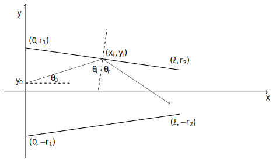

# Biliardo triangolare

## Descrizione del sistema

La geometria del sistema considerato è mostrato in figura

Il sistema è delimitato da due segmenti rettilinei, dati dai punti
$[(0, r_1), (\ell, r_2)]$ e $[(0, -r_1), (\ell, -r_2)]$ rispettivamente.

Una particella puntiforme parte da $(0, y_0)$, $y_0 \in [-r_1, r_1]$, con un
angolo $\theta_0$ e interagisce nel punto $(x_\mathrm{i}, y_\mathrm{i})$ con uno
dei due segmenti di delimitazione, in questo caso quello superiore.
L'interazione consiste in una riflessione, per cui 
$\theta_\mathrm{i} = \theta_\mathrm{r}$, dove $\theta_\mathrm{i}$ e $\theta_\mathrm{r}$
rappresentano rispettivamente gli angoli incidente e riflettente. Si noti
come la direzione normale al segmento non dipende dalle coordinate del punto
incidente $(x_\mathrm{i}, y_\mathrm{i})$ ed è data da

$$
y = \mp \frac{\ell}{(r_2-r_1)} ( x - x_\mathrm{i} ) + y_\mathrm{i}
$$

dove $\mp$ si riferisce al segmento superiore o inferiore rispettivamente.

## Obiettivo

Progettare e sviluppare un codice che calcoli la traiettoria di una particella
all'interno del sistema sopradescritto, con coordinate iniziali, cioè in $x = 0$,
date da $(y_0, \theta_0)$ , e determini le coordinate finali, cioè in
$x=\ell$, date da $(y_\mathrm{f}, \theta_\mathrm{f})$.

Supponendo che le condizioni iniziali siano caratterizzate da due distribuzioni
Gaussiane indipendenti, rispettivamente con parametri $(\mu_{y_0}, \sigma_{y_0})$
e $(\mu_{\theta_0}, \sigma_{\theta_0})$, determinare le
distribuzioni di $y_\mathrm{f}$ e $\theta_\mathrm{f}$ e studiare come variano al
variare di $\ell$, mantenendo costanti $r_1$ e $r_2$.
